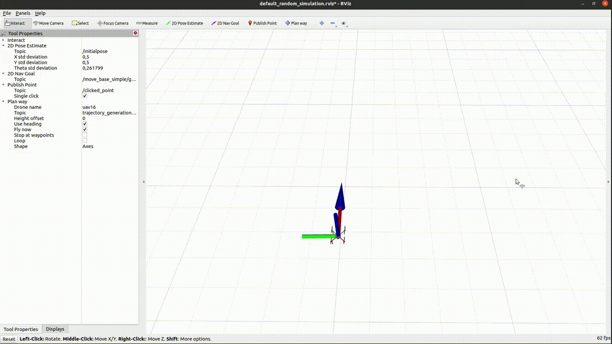

# RVIZ plugins

This repository serves to show my contributions to developing tools for Multy robot system group.

## WaypointPlanner tool

Allows sending a sequence of waypoints to drone.
The click-and-pull input supplies a 2D position with heading (a waypoint). Tool properties allow customization (height change, fly now, loop, use heading).

[Current version.](https://github.com/ctu-mrs/mrs_rviz_plugins/tree/waypoint_planner)

## UAV Status

Displays useful information about the UAV state and sensors.

[Current version.](https://github.com/ctu-mrs/mrs_rviz_plugins/tree/control)

## Control tool

Provides convenient interface for controling the drone(s).

[Current version.](https://github.com/ctu-mrs/mrs_rviz_plugins/tree/control)

