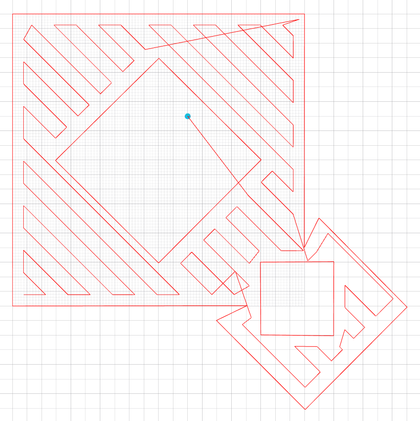
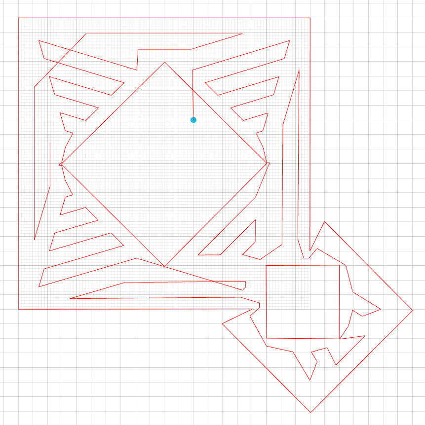
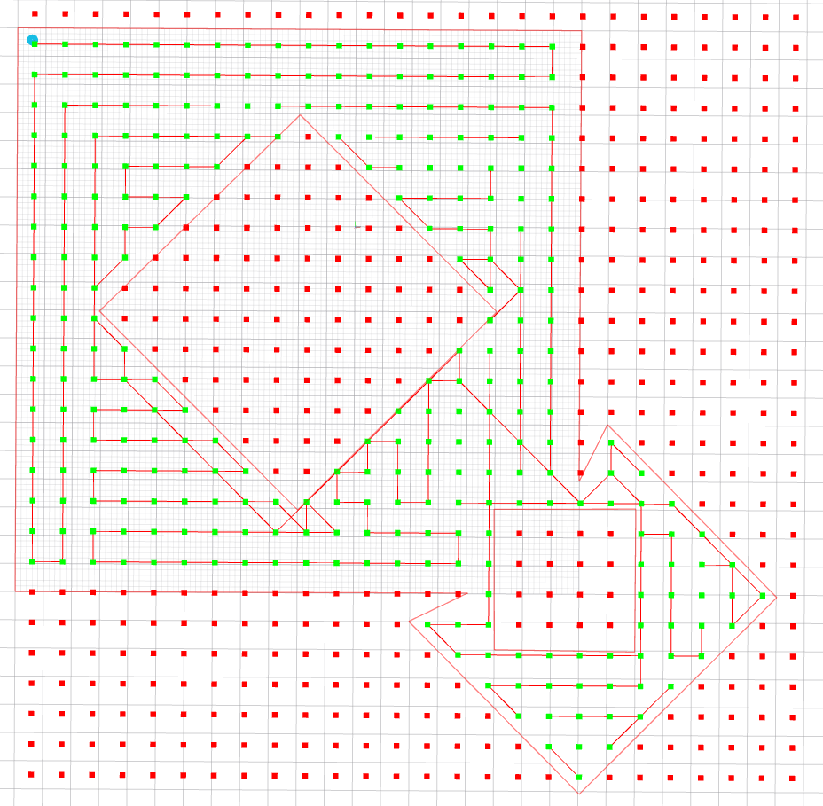

# RVIZ plugins
This repository serves to show my contributions to developing tools for Multi-Robot Systems group.

<h3>Used technologies:</h3>  

# World Manager

https://github.com/LazyTitanik/RVIZ-plugins/assets/108675472/5a58d916-7fb4-4a1b-80c5-996bafa5f909

# WaypointPlanner tool

Allows sending a sequence of waypoints to a drone.
The click-and-pull input supplies a 2D position with a heading (a waypoint). Tool properties allow customization (height change, fly now, loop, use heading).

[Source code](https://github.com/ctu-mrs/mrs_rviz_plugins/tree/control/src/waypoint_planner)

# Coverage Path Planning Methods

Implements and integrates the three most suitable coverage path planning algorithms into the MRS UAV System.  

[Source code](https://github.com/ctu-mrs/mrs_rviz_plugins/tree/control/src/coverage_path_planning)

## Morse-based algorithm

To the extent of our knowledge, this implementation is the first open-source non-discrete implementation of Morse decomposition, that can be extended with any other Morse function.
The algorithm is described by Ercan U. Acar et al. in "Morse Decompositions for Coverage Tasks".

## Diagonal decomposition-based algorithm

The algorithm is described by Marina Torres et al. in "Coverage path planning with unmanned aerial vehicles for 3D terrain reconstruction".
As a decomposition method, Mp3 from José Fernández et al. "A practical algorithm for decomposing polygonal domains into convex polygons by diagonals" was used.

## Stride method

The algorithm is described by Eduard Santamaria et al. in "Path Planning for Rapid Aerial Mapping with Unmanned Aircraft Systems".
The algorithm is based on approximate cellular decomposition, therefore the grid is shown in the picture below.

# UAV Status

Displays useful information about the UAV state and sensors.

[Source code](https://github.com/ctu-mrs/mrs_rviz_plugins/tree/control/src/uav_status)

# Control tool

Provides a convenient interface for controlling the drone(s).

[Source code](https://github.com/ctu-mrs/mrs_rviz_plugins/tree/control/src/control)

